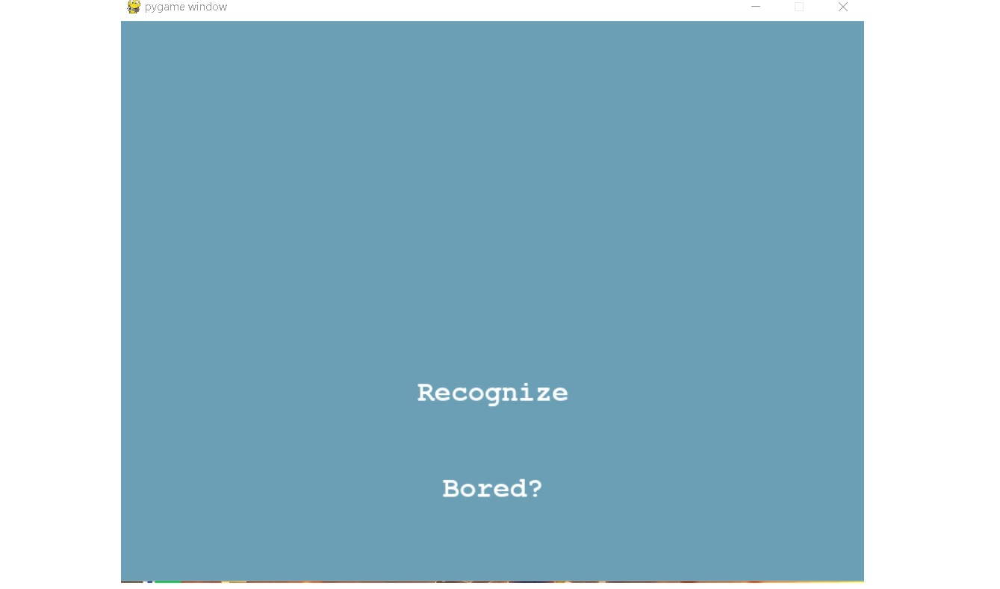
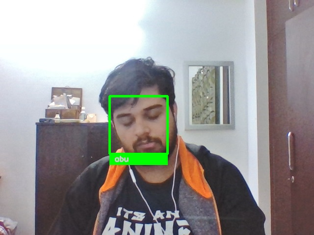
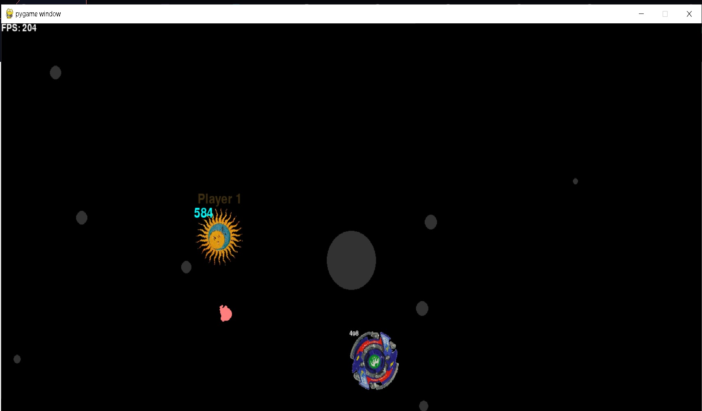
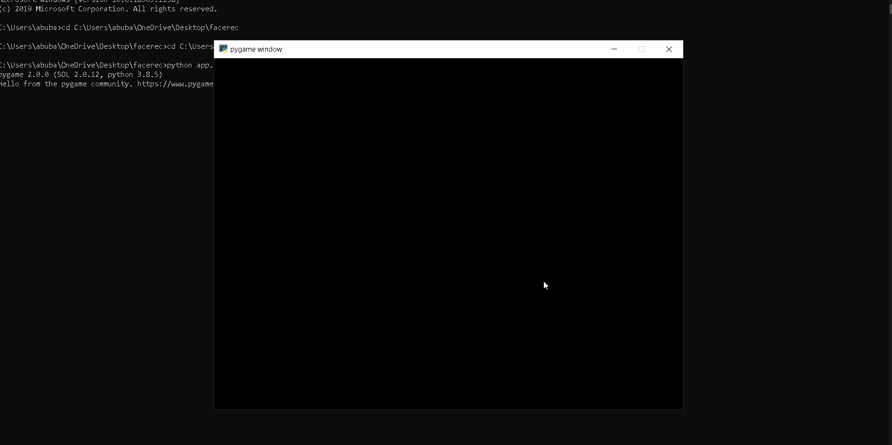

# python-assignment

fork this repo and start your work 
<div align="center">
<h1 align="center">Facial Recognition with pygame</h1>
 <h5 align = "left">Using face_recognition library to recognize the face of the person infornt of the camera and using Pygame for the Graphical User Interface(GUI) of the following, also has a beyblade game if the user is bored.
</h5>

  
  
  
  
  
  
</div>
### How it works
This facial recognition program uses multiple library and modules, unlike our usual 
OpenCV and Tensorflow/Pytorch model we are using a pre exisitng solution i.e. 
[face_recognition](https://github.com/ageitgey/face_recognition) which recognizes and manipulates faces from Python or from 
the command line with the world's simplest face recognition library. For this we need a small data set of known faces which will
be compared to the faces that appear infront of the camera. Then the library compares the unknown face to the known face and if 
the faces match, a green box with the name of the person appears.This output is then showed using the [pygame](https://www.pygame.org/) 
module, which is used to make an interactive GUI. During this whole process our machine goes through many states, and as asked by the assigners 
the program was supposed to be written on [Finite State Machine](https://medium.com/@mlbors/what-is-a-finite-state-machine-6d8dec727e2c), for this
we will use another module called [pytransition](https://github.com/pytransitions/transitions) which is a lightweight, object-oriented state machine implementation in Python with many extensions. All together with these modules the above project is made.

# Screenshots


#### Homepage
```sh
   The homepage of the GUI, click the "Recognize" button to start recognizing 
   Press the "Bored?" button to play the game.
 ```
 </a>
</div>

#### Capture Page
```sh
   Press the "Capture" button to take a photo of the person in front of the camera which shall then be analyzed
 ```
 </a>
</div>

#### Recognized Face
```sh
   The face once recognised shall be displayed as shown: 
   PS: Don't expect a DP worthy pic to be taken xD
 ```
 </a>
</div>

#### Beyblade Game
```sh
   Recognizing faces could be boring....take a break!
 ```
 </a>
</div>

#### DEMO


